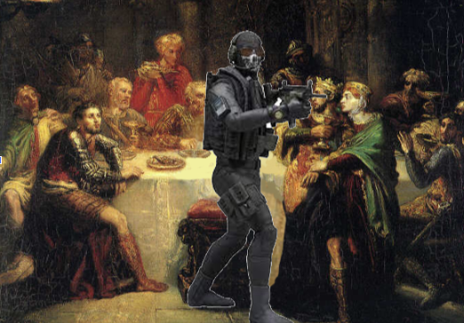
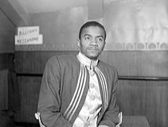
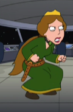
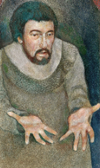
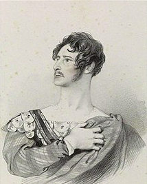
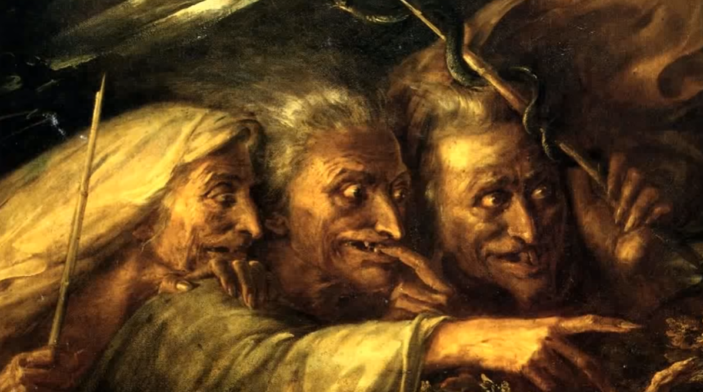
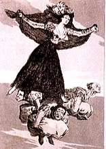

<body style="background-color:black;">
<title>Top 9 strongest MacBeth characters</title>
<link rel="icon" href="icon.png" type = "image/x-icon">
<h1><pre>                      TOP 9 MOST CHARACTERS IN MACBETH</h1></pre>
<pre>                                 who are the most powerful characters in MacBeth (includes strength, intelligence, and leadership)?.</pre>

<h4>Number 9: King Duncan</h4>

King Duncan, in his prime, was a king, so he is a very powerful and influential person. It is unknown how smart or strong he is, but he was still a king, which is why he is on the list.  

<h4>Number 8: Banquo’s ghost</h4>

<h4>Number 7: MacDuffs son</h4>

<pre>Macduffs son is a highly underrated character in the novel, he is someone who's 
capable of keeping a neutral face while a sharp blade has been logged within him. 
He is also able to defy laws of life and death, and somehow manage to speak while 
he has been murdered, as dead people are not supposed to talk, talking when 
dead is quite impossible. 

“He has kill'd me, mother:
Run away, I pray you!
Dies                      “(IV, II). 

This quote even shows how much of a brave gentleman he is, he does not care about 
the fact he had just been murdered, he only cares about the safety of his beloved 
mother. He is truly a powerful and incredible character in the entire play of
MacBeth. And to top it off, he is even considerate of logic, and decides to die
afterwards.
</pre>
<h4>Number 6: Malcolm</h4>

Malcom is a kind and honest king in his prime, he was capable of overthrowing MacBeth and bringing back peace to Scotland. 

<h4>Number 5: Lady MacBeth</h4>

 In her prime, Lady MacBeth is cruel, manipulative and powerful, she was the mind behind MacBeth, while she had to meet her end due to guilt finally catching up to her, she was still very powerful during her prime state. 

<h4>Number 4: McBeth</h4>

MacBeth started off as a kind of strong guy, but because of Lady MacBeth, he became cruel and even more ruthless than even Lady MacBeth, making him be placed higher than her. MacBeth is also physically strong, meaning he is capable of beating most people. 

<h4>Number 3: Macduff</h4>

Macduff became powerful after receiving a sad backstory to fight MacBeth, his dead family gave him the power of rage which he used to kill MacBeth. He was also chosen as the guy to kill MacBeth by the three witches.

<h4>Number 2: The three witches</h4>

They are supernatural beings who bring forth death and destruction, they have the power to manipulate and create prophecies.  They can be considered the more evil, guiltless, magical, and dangerous than Lady MacBeth in every way possible. There are also 3 of them so that adds to their power.  

<h4>Number 1: Hectate</h4>

She's a god

---------------------------------------------------------------------------------------------------------------------------------------------------------------------------------------------------------------------------------------------------

<h2>Work cited</h2>
<pre>
<a href = "https://familyguy.fandom.com/wiki/Lady_Macbeth"> lady MacBeth and king Duncan</a>
<a href = "hrefthttps://en.wikipedia.org/wiki/Banquo"> banquos ghost</a>
<a href = "https://mobile.twitter.com/macduffson"> Macduffs son</a>
<a href = "https://en.wikipedia.org/wiki/Malcolm_%28Macbeth%29"> Malcom</a>
<a href = "https://en.wikipedia.org/wiki/Macduff_%28Macbeth%29"> MacDuff</a>
<a href = "https://en.wikipedia.org/wiki/Three_Witches"> Three witches</a>
</pre>
 
